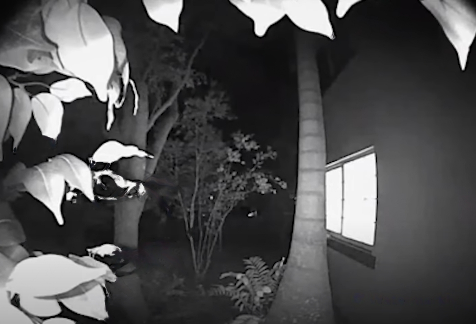

# Masking out Parts of Images

You are supposed to write a code which takes your video input and removes the background of the image. This might initially appear hard but this if seen stepwise is not that hard. Generally, other things are used for this task, however, we are using this simple method(Even though highly inacurate)
You have to run the masking and centroid commands on the two images which have been attached considering, one as a foreground and one the other as the background.
*NOTE*:All you have to do is follow the instructions below step by step. 

---

## Video and Image Inputs

- The image input is generally takes using the imread command. You can further read about its.

- The Camera input is taken using the videocapture function. You are supposed to use it in the code.

A template for using the video capture function is given below:
```python
import cv2

# Create a VideoCapture object
cap = cv2.VideoCapture(0)  # 0 corresponds to the default camera

# Check if camera is opened successfully
if not cap.isOpened():
    print("Unable to open the camera.")
    return

while True:
    # Read frame from the camera
    ret, frame = cap.read()    # If frame is read correctly, ret will be True

    # Here you are supposed to place the processing code

    if ret:
        # Display the resulting frame in a window
        cv2.imshow('Camera', frame)

    # Break the loop when 'q' key is pressed
    if cv2.waitKey(1) == ord('q'):
        break

# Release the VideoCapture object and close the window
cap.release()
cv2.destroyAllWindows()
```

---

## Edge Detection

- Here you are supposed to again take the video feed and use it for canny edge detection
- Before Processing the image, it is important that you generally follow these steps:
    - Convert to Grayscale (Direct OpenCV Func)
    - Use a Filter on the image : Gaussian Blur (Direct OpenCV Func)
- Following this you are supposed to use Canny Edge detection (Direct OpenCV function) and output only the edges
- For those who are curious, can try implementing the functions independent of OpenCV *(Highly Recommended)*

---

## Masking out the changes

- Here we will simply be comparing changes in the image over time. So for this code to work, you would have to initially show the screen an empty background.
- Again, you will be asked to use the standard procedure, i.e.
    - Grayscaling
    - Gaussian Bluring
- Followed by this you are supposed to subtract the initially saved first frame to get the change
- You are supposed to threshhold the image (Direct OpenCV Function)
- Now, you are supposed to use Opening and Closing as given in the lectures ( You are supposed to write your own functions for these)
- Through this you will be able to differentiate clearly the background from the foreground
- Now you are supposed to take the initial image and only count those pixels where u see a 1 and remove those where you find 0
- Now, I want you to keep the background Black and have a colored foreground
- Here, I want you to output both the pre-processed images and processed images

---

## Centroid Detection

- Here, I want you to write a function to find the centroid of the part of the foreground you have selected and removed out from the image
- For this you are supposed to take the final image after removing the backround
(In case you face issues with the previous part, you can just directly use an image/ your Webcam Feed)
- Again, you will be asked to use the standard procedure, i.e.
    - Grayscaling
    - Gaussian Bluring
- Now, you are supposed to find the moments (Direct OpenCV Function)
- Now, using the moments, find the Coordinates of the Centroid
- Draw a red circle on top of the initial image on these coordinates (Direct OpenCV Function)

---

## Resources

- [Photogrammetry](https://www.ipb.uni-bonn.de/photo12-2021/)
    - You can use the lectures for Python, Matplotlib, Numpy in case you have never been exposed to these
- [OpenCV](https://www.geeksforgeeks.org/opencv-python-tutorial/)
    - You can use this for the syntax. Again would recommend you to specifically search the required functions
    - Remember for the specific search for functions, you can also use Chat GPT

---

## Example

Here is an example of what the images that you have to take will look like

The two images are an example of how the images should differ. The only difference will be that you will have your own picture with any backgroud and isolate your the differences, preferably a picture of yourself. 





The above example can be treated as a test case.
---

## Submission

- Here is the Github <a href="https://github.com/AerialRobotics-IITK/Induction_Y22">link</a>
- Update the fork's main branch and subsequently push the code into your own branch
- Then create a pull request by 11:59:59, 25th May 2023
- In case of any doubts, create an issue on the main repo (And DM me or any of the others too :) )
- Again, irrespective of task completion I would be expecting all 19 Pull requests on time.

---
